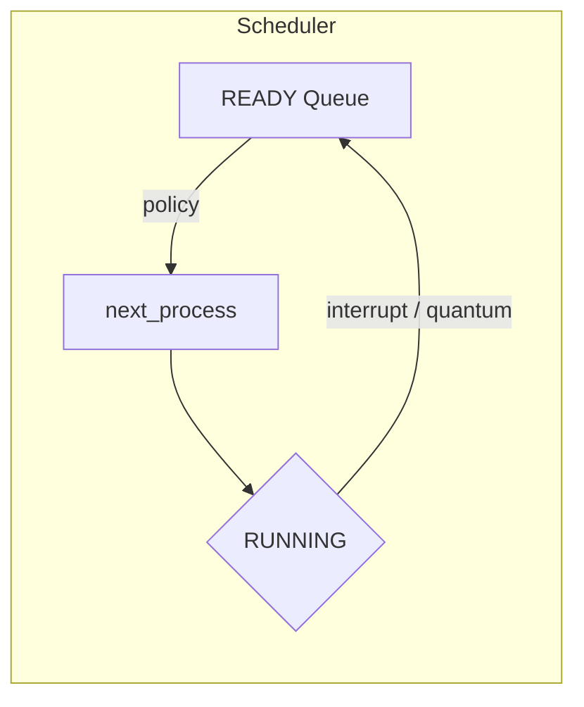

# Algoritmos Utilizados

## Planificación (por CPU)
- FCFS: cola FIFO por prioridad/arribo.
- SJF: selecciona el menor `duration_ticks` considerando prioridad.
- SRTF: preempción si `remaining_ticks` del candidato es menor (y prioridad más alta).
- RR: Round Robin con `quantum`; reencola al expirar.
- Priority: con envejecimiento opcional; preempción si llega prioridad mayor.
- PriorityRR: colas por prioridad con quantum.

## Memoria Contigua
- Estrategias: First Fit, Best Fit, Worst Fit.
- Compactación: automática si `fragmentation_ratio ≥ threshold` o por intervalo.
- Bloque SO (PID 0):
  - Inicial `16 MB`.
  - Expansión: `16 MB + 2 MB × procesos activos`.
  - Preservado siempre al inicio; compactación reubica libres detrás.

## Memoria Paginada
- Tamaño de página: `4 MB`.
- Reemplazo: FIFO, LRU, Optimal.
- Métricas: `page_faults`, `page_hits`, `page_fault_rate`, `memory_utilization`.
- Acceso: si no presente, page fault y asignación a frame libre o víctima según algoritmo.

## Interrupciones
- Tipos: SYSCALL, IO, PAGE_FAULT, TIMER.
- Probabilidades deterministas: función hash por `(pid, tick, salt)`.
- Al entrar en WAITING: se libera la CPU y se decrementa `io_remaining_ticks` cada tick.

## Métricas del Sistema
- Turnaround promedio, tiempo de espera promedio.
- Utilización global de CPU = `busy_cpus / total_cpus`.
- Ticks CPU efectivos = suma de hilos activos por tick.
