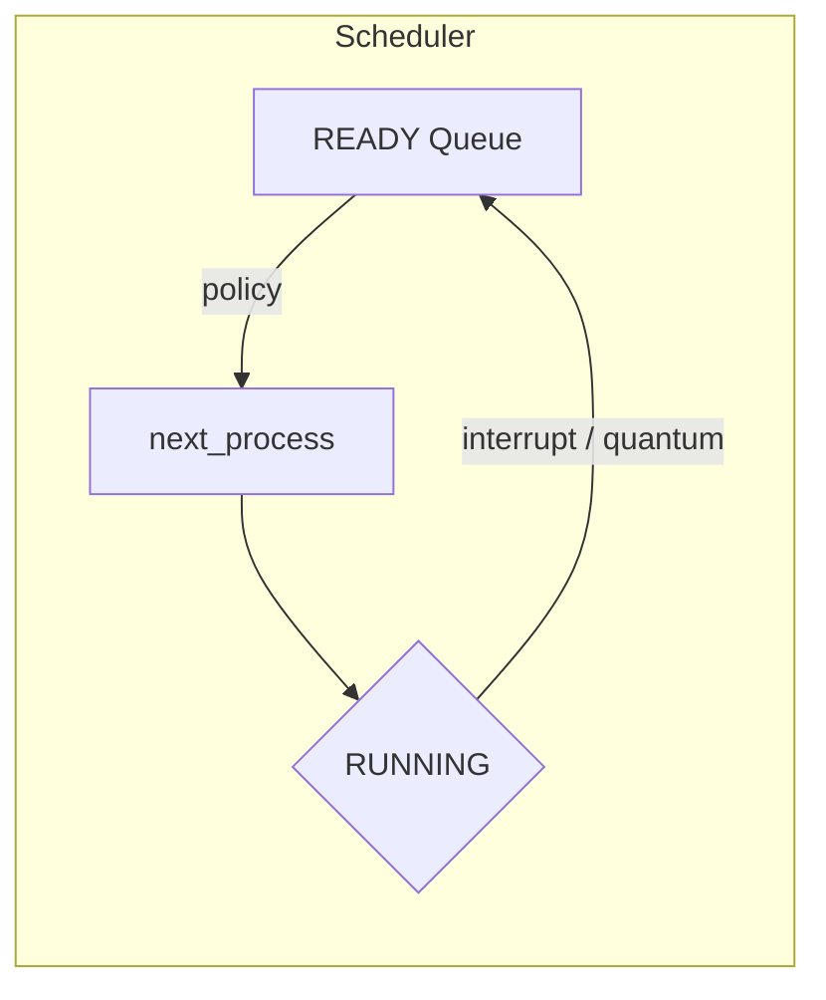

# Algoritmos Utilizados

## Planificación (por CPU)
- **FCFS (First-Come, First-Served):** Cola FIFO simple. Los procesos se ejecutan en el orden en que llegan.
- **SJF (Shortest Job First):** Selecciona el proceso con menor duración estimada (`duration_ticks`). No expropiativo.
- **SRTF (Shortest Remaining Time First):** Versión expropiativa de SJF. Si llega un proceso con menor tiempo restante que el actual, lo reemplaza.
- **Round Robin (RR):** Asigna un tiempo fijo (`quantum`) a cada proceso. Si no termina, vuelve al final de la cola.
- **Priority:** Planificación basada en prioridad estática (0-9). Incluye mecanismo de envejecimiento (aging) para evitar inanición.
- **Priority Round Robin:** Mantiene colas separadas por nivel de prioridad. Dentro de cada nivel, usa Round Robin.

```mermaid
flowchart LR
    subgraph Scheduler
    A[READY Queue] -->|policy| B[next_process]
    B --> C{RUNNING}
    C -->|interrupt / quantum| A
    end
```

## Memoria Contigua
- **Estrategias de Asignación:**
    - *First Fit:* Asigna el primer bloque libre con tamaño suficiente. Rápido pero fragmenta.
    - *Best Fit:* Busca el bloque que deje el menor desperdicio. Minimiza fragmentación interna pero es lento.
    - *Worst Fit:* Asigna el bloque más grande disponible. Deja huecos grandes reutilizables.
- **Compactación:** Automática si `fragmentation_ratio ≥ threshold` o por intervalo de tiempo. Mueve todos los procesos hacia el inicio para fusionar memoria libre.
- **Bloque SO (PID 0):**
  - Tamaño base: `64 MB`.
  - Expansión dinámica: `64 MB + 2 MB × procesos activos`.
  - Preservado siempre al inicio de la memoria física.

## Memoria Paginada
- **Tamaño de página:** `4 MB`.
- **Algoritmos de Reemplazo:**
    - *FIFO:* Reemplaza la página más antigua en memoria.
    - *LRU (Least Recently Used):* Reemplaza la página que no se ha usado por más tiempo.
    - *Optimal:* Reemplaza la página que no se usará por más tiempo en el futuro (teórico).
- **Métricas:** `page_faults`, `page_hits`, `page_fault_rate`, `memory_utilization`.
- **Acceso:** Si la página no está presente (bit de validez 0), se genera un `PAGE_FAULT`, el proceso pasa a WAITING y se carga la página desde el almacenamiento secundario.

## Interrupciones
- **Tipos:** SYSCALL, IO, PAGE_FAULT, TIMER.
- **Determinismo:** Las probabilidades de interrupción se calculan mediante un hash de `(pid, tick, salt)` para garantizar que la simulación sea reproducible.
- **Manejo:** Al entrar en WAITING, se libera la CPU inmediatamente. El proceso decrementa su contador de espera (`io_remaining_ticks`) en cada tick global.

## Métricas del Sistema
- **Throughput:** Procesos completados por unidad de tiempo.
- **Turnaround Time:** Tiempo total desde la llegada hasta la finalización.
- **Waiting Time:** Tiempo total que un proceso pasa en la cola READY.
- **Utilización de CPU:** Porcentaje de tiempo que las CPUs están ejecutando procesos.
- **Eficiencia de Memoria:** Relación entre memoria usada y memoria total.

