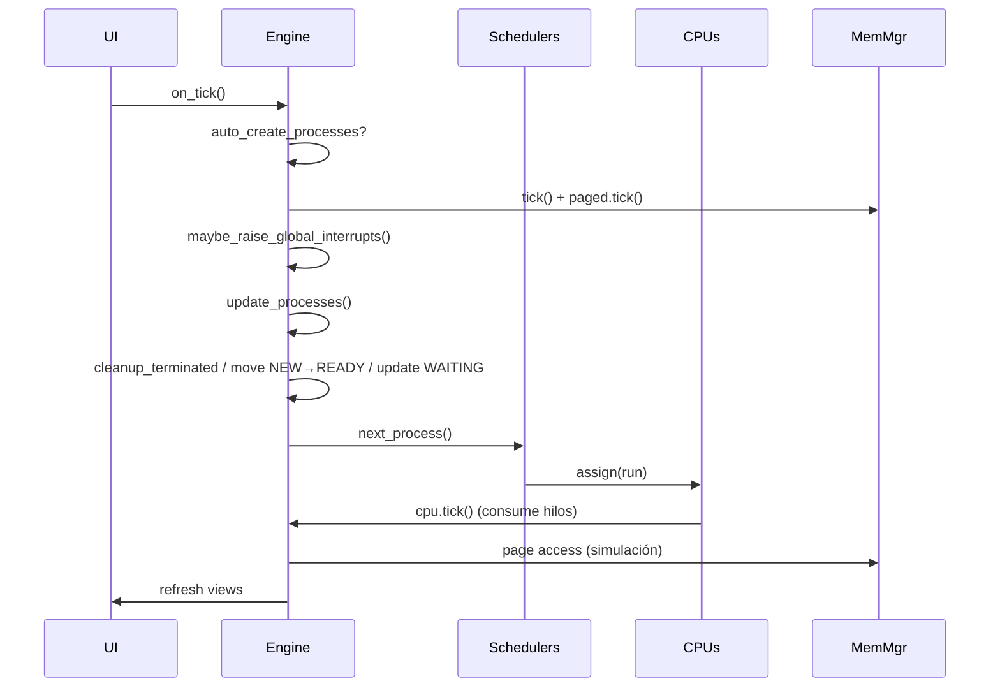

# Arquitectura y Relaciones

## Arquitectura Modular
- Núcleo base activo + módulos dinámicos (Planificación, Interrupciones, Gestor de Memoria/Procesos).
- Se eliminan rutas Monolithic/Microkernel (solo visualización modular).
- Flujo entre capas: UI ⇄ Kernel ⇄ Módulos (tail de últimos 10).

```mermaid
flowchart TD
    UI[UI PyQt6] -->|tick / controles| Kernel[Engine (Modular)]
    Kernel --> Sched[Planificadores por CPU]
    Kernel --> MemCont[Gestor Memoria Contigua]
    Kernel --> MemPag[PagedMemoryManager]
    Kernel --> IntCtrl[InterruptController]
    Sched --> CPU1[CPU #1]
    Sched --> CPU2[CPU #2]
    Sched --> CPU3[CPU #3]
    Sched --> CPU4[CPU #4]
    MemCont --> MU1[Unidad Mem #1]
    MemCont --> MU2[Unidad Mem #2]
    MemPag --> MU1
    MemPag --> MU2
    IntCtrl --> Kernel
```

## Relaciones entre Archivos
```text
engine.py
 ├─ usa models.py (Process, CPU)
 ├─ usa scheduler.py (FCFS, SJF, SRTF, RR, Priority, PriorityRR)
 ├─ usa memory/manager.py (MemoryManager, PagedMemoryManager)
 │   └─ usa memory/strategies.py (First/Best/Worst Fit)
 └─ usa interrupts.py (Interrupt, InterruptType, InterruptController)

frontend/windows/main_window.py
 ├─ instancia SimulationEngine
 ├─ timer → on_tick → engine.tick()
 └─ actualiza vistas (processes_view, memory_view)
```

## Componentes del Núcleo
- Engine:
  - Ciclo de `tick`: crear procesos, actualizar memoria, manejar interrupciones, ejecutar CPUs, asignar procesos, acumular métricas.
  - Reserva SO: bloque PID 0 al inicio de cada unidad, crecimiento monótono.
- Scheduler (por CPU): política seleccionable y despacho.
- Memoria (por unidad):
  - Contigua: bloques, fragmentación, compactación con bloque SO preservado.
  - Paginada: frames, tablas por proceso, page faults/hits, algoritmos de reemplazo.
- Interrupciones: SYSCALL/IO/PAGE_FAULT/TIMER.

## Flujo de Peticiones en Tick

