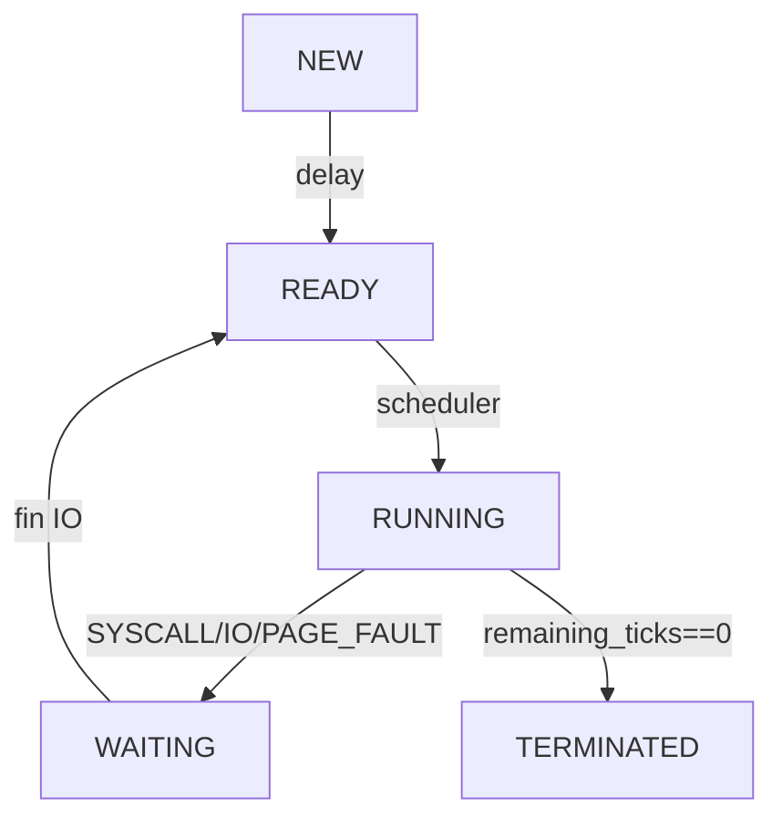
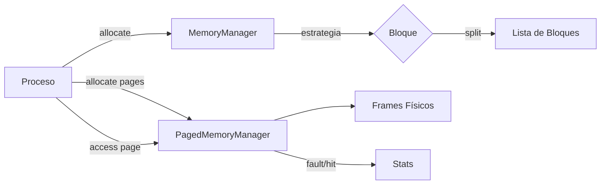

# Flujos y Graficación

## Flujo de Gestión de Procesos


### Detalles
- NEW: procesos recién creados; pasan a READY tras `new_state_delay`.
- READY: acumulan `waiting_ticks` cada tick; asignación por el scheduler.
- RUNNING: consumen `remaining_ticks` acorde a `threads_in_use` de la CPU.
- WAITING: decrementan `io_remaining_ticks`; al finalizar vuelven a READY.
- TERMINATED: liberan memoria contigua y paginada; se contabiliza en métricas.

## Flujo de Gestión de Memoria


### Reserva del Sistema (SO)
- Bloque inicial `16 MB` al inicio de cada unidad.
- Crece monótonamente: `16 + 2×(procesos activos)`.
- No expropiable, siempre al inicio.

## Flujo entre Capas (tail de 10)
```text
[Tick N] UI → Kernel
[Tick N] Kernel → Módulo de Planificación
[Tick N] Módulo de Planificación → Núcleo Base (dispatch)
... (máximo 10, los anteriores se purgan)
```

## Graficación (UI)
- Procesos: tabla con CPU asignada, uso %, memoria, tiempos, prioridad.
- Memoria: barra por unidad con bloques; SO en azul (etiqueta "SO").
- Tabla comparativa por unidad: Total, SO Reservado, Usado, Fragmentación, Eficiencia, Algoritmos, Faults/Hits, Rates, Utilización.
