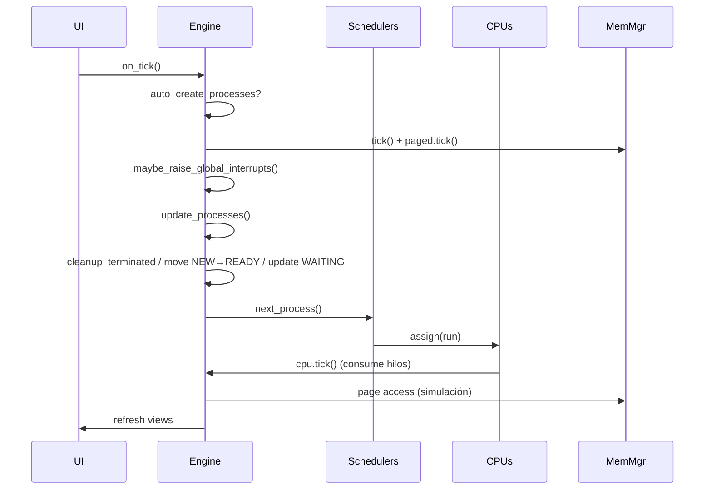
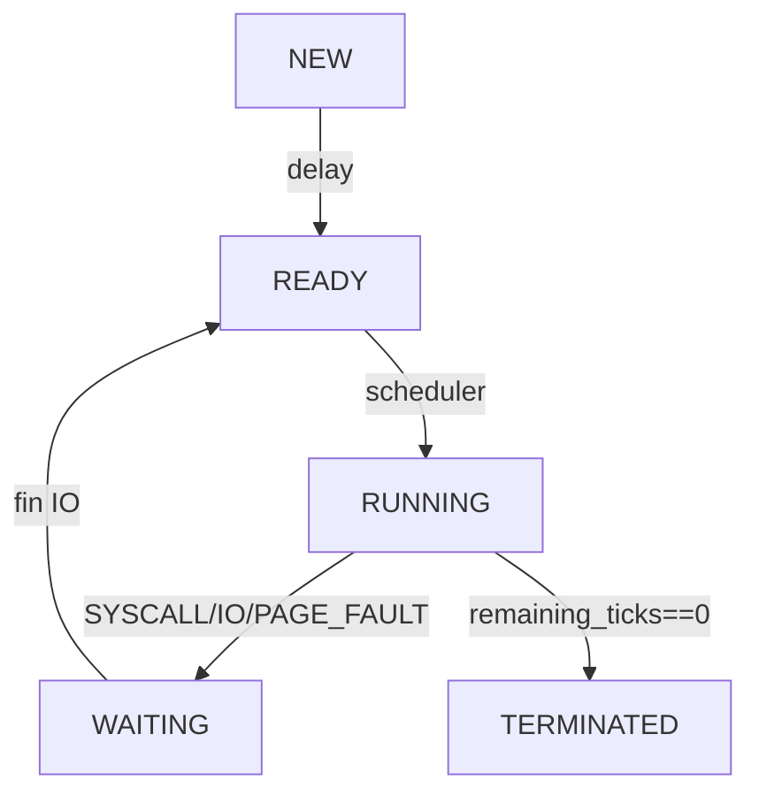
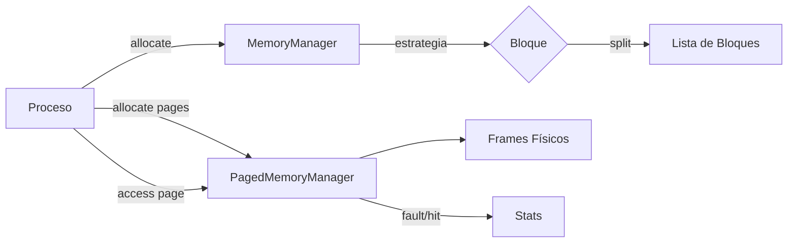

# Documentación Detallada de la Implementación del Simulador de SO

Este documento consolida toda la información técnica, de diseño y de implementación del simulador de Sistema Operativo. Su objetivo es servir como una guía exhaustiva del código fuente, las decisiones de diseño y el funcionamiento interno del proyecto.

---

## 1. Visión General del Proyecto

El proyecto es una simulación detallada del funcionamiento interno de un Sistema Operativo (SO), desarrollada en Python con una interfaz gráfica en PyQt6. Está estructurada para facilitar su estudio, ampliación e implementación.

### 1.1. Objetivos Principales
- **Arquitectura Exclusivamente Modular:** El simulador se centra en una arquitectura modular, eliminando la complejidad de modelos monolíticos o microkernel para enfocarse en un diseño más moderno y flexible.
- **Planificación Avanzada por CPU:** Cada CPU cuenta con su propio planificador, permitiendo la selección individual de algoritmos como FCFS, SJF, SRTF, Round Robin, y variantes con prioridad.
- **Simulación de Interrupciones Determinista:** El sistema modela interrupciones de `TIMER`, `SYSCALL`, `I/O` y `PAGE_FAULT` de forma predecible para garantizar la reproducibilidad de las simulaciones.
- **Gestión de Memoria Multi-Unidad:** Soporta múltiples unidades de memoria, cada una con su propio gestor para asignación contigua (con autocompactación) y memoria paginada (con algoritmos de reemplazo).
- **Reserva de Memoria para el SO:** Un bloque de memoria (PID 0) es reservado para el sistema operativo en la primera unidad de memoria. Este bloque es no expropiable y crece dinámicamente con el número de procesos activos.
- **Conceptos de Memoria Virtual:** El simulador incluye la traducción de direcciones virtuales y reporta una capacidad de memoria virtual ampliada.

### 1.2. Estructura del Proyecto
- `src/os_core/`: Contiene la lógica del núcleo del SO.
    - `models.py`: Define las estructuras de datos como `Process`, `CPU`, `Page`.
    - `scheduler.py`: Implementa los diferentes algoritmos de planificación.
    - `memory/`: Contiene la lógica de gestión de memoria.
        - `manager.py`: Implementa `MemoryManager` (contigua) y `PagedMemoryManager` (paginada).
        - `strategies.py`: Define las estrategias de asignación (First Fit, Best Fit, Worst Fit).
    - `interrupts.py`: Gestiona la lógica de interrupciones.
    - `architectures.py`: Define la estructura de la arquitectura modular.
- `src/simulation/`:
    - `engine.py`: Es el motor central de la simulación que coordina todos los componentes del `os_core`.
- `src/frontend/`: Contiene la interfaz gráfica de usuario (GUI) desarrollada con PyQt6.
    - `windows/main_window.py`: La ventana principal de la aplicación.
    - `views/`: Vistas específicas para procesos, memoria, etc.
    - `components/`: Widgets reutilizables como la consola y las barras de memoria.
- `run.py`: El punto de entrada para ejecutar la aplicación.
- `documentacion/`: Todos los archivos de documentación del proyecto.

---

## 2. Arquitectura del Sistema

El simulador implementa una **arquitectura estrictamente modular**, donde el núcleo base se complementa con módulos que gestionan funcionalidades específicas.

```mermaid
flowchart TD
    UI[UI PyQt6] -->|tick / controles| Kernel[Engine (Modular)]
    Kernel --> Sched[Planificadores por CPU]
    Kernel --> MemCont[Gestor Memoria Contigua]
    Kernel --> MemPag[PagedMemoryManager]
    Kernel --> IntCtrl[InterruptController]
    Sched --> CPU1[CPU #1]
    Sched --> CPU2[CPU #2]
    Sched --> CPU3[CPU #3]
    Sched --> CPU4[CPU #4]
    MemCont --> MU1[Unidad Mem #1]
    MemCont --> MU2[Unidad Mem #2]
    MemPag --> MU1
    MemPag --> MU2
    IntCtrl --> Kernel
```

### 2.1. Componentes del Núcleo (`os_core`)
- **Engine (`simulation/engine.py`):** Es el corazón del simulador. Su ciclo de `tick` orquesta todas las operaciones: creación de procesos, actualización de memoria, manejo de interrupciones, ejecución de CPUs, asignación de procesos y acumulación de métricas.
- **Scheduler (por CPU):** Cada CPU tiene una instancia de un planificador, cuya política es seleccionable desde la UI.
- **Gestor de Memoria (por unidad):** Cada unidad de memoria tiene sus propios gestores para memoria contigua y paginada.
- **Controlador de Interrupciones:** Un controlador central gestiona las interrupciones de tipo `SYSCALL`, `IO`, `PAGE_FAULT` y `TIMER`.

### 2.2. Flujo de Peticiones en un Tick
El ciclo de vida de un tick de simulación sigue una secuencia ordenada para mantener la coherencia del estado.



---

## 3. Gestión de Procesos

Un **proceso** es un programa en ejecución. En el simulador, está representado por la clase `Process` en `src/os_core/models.py`.

### 3.1. Estados del Proceso
Un proceso atraviesa diferentes estados durante su ciclo de vida, lo que determina su comportamiento y cómo es gestionado por el planificador.



- **NEW:** El proceso ha sido creado pero aún no está listo para competir por la CPU. Pasa a `READY` tras un breve retardo (`new_state_delay`).
- **READY:** El proceso está en la cola de listos, esperando a ser seleccionado por el planificador para su ejecución. Acumula `waiting_ticks`.
- **RUNNING:** El proceso está actualmente asignado a una CPU y está ejecutando sus instrucciones. Consume `remaining_ticks`.
- **WAITING:** El proceso está esperando que se complete un evento externo, como una operación de I/O. Durante este estado, decrementa `io_remaining_ticks` y la CPU que ocupaba es liberada.
- **TERMINATED:** El proceso ha completado su ejecución. Sus recursos (memoria) son liberados y sus métricas son contabilizadas.

### 3.2. Bloque de Control de Proceso (PCB)
La clase `Process` actúa como el PCB. Contiene toda la información vital del proceso:
- `pid`: Identificador único del proceso.
- `state`: El estado actual (`NEW`, `READY`, etc.).
- `priority`: Nivel de prioridad (0-9).
- `memory_mb`: Cantidad de memoria requerida.
- `duration_ticks`: Duración total de la ráfaga de CPU.
- `remaining_ticks`: Ticks restantes para completar la ejecución.
- `waiting_ticks`: Ticks que el proceso ha pasado en estado `READY`.
- `io_remaining_ticks`: Ticks restantes para una operación de I/O.

### 3.3. Cambio de Contexto (Context Switch)
Ocurre cuando el planificador cambia el proceso que se está ejecutando en una CPU. Aunque no se simula un coste explícito en ticks, el mecanismo de preempción y re-planificación representa este concepto.

---

## 4. Planificación de Procesos

El simulador soporta la asignación de un algoritmo de planificación distinto para cada CPU, lo que permite comparar su rendimiento en un entorno multiprocesador.

### 4.1. Algoritmos Implementados (`src/os_core/scheduler.py`)

- **FCFS (First Come, First Served):** No apropiativo. Los procesos se atienden en el orden en que llegan, pero los de mayor prioridad se colocan al frente de la cola.
- **SJF (Shortest Job First):** No apropiativo. Selecciona el proceso con la menor `duration_ticks`, desempatando con la prioridad.
- **SRTF (Shortest Remaining Time First):** Apropiativo. Si llega un proceso con un `remaining_ticks` menor (y mayor o igual prioridad) que el actual, se produce una preempción.
- **Round Robin (RR):** Apropiativo. Cada proceso se ejecuta por un `quantum` de tiempo. Si no termina, es movido al final de la cola de listos.
- **Priority:** Apropiativo. El proceso con la mayor prioridad (menor valor numérico) se ejecuta. Un proceso de mayor prioridad puede interrumpir a uno de menor prioridad. Incluye **aging** para evitar la inanición de procesos de baja prioridad.
- **PriorityRR (Priority Round Robin):** Múltiples colas, una por cada nivel de prioridad. Se aplica Round Robin dentro de cada cola, y las colas de mayor prioridad siempre se procesan primero.

### 4.2. Sistema de Prioridades
La prioridad es un valor de 0 a 9, donde 0 es la más alta.

#### Asignación Automática de Prioridad
- Se basa en el tamaño (30%), duración (40%) y uso de CPU (30%) del proceso.
- Procesos más pequeños y cortos reciben mayor prioridad.
- Se añade una variación aleatoria para diversificar.

#### Aging (Envejecimiento)
- Implementado en el `PriorityScheduler`.
- Cada 10 ticks, los procesos que han esperado más de 20 ticks en la cola de listos ven su prioridad aumentada (el valor numérico disminuye en 1), hasta un máximo de 0.
- Esto garantiza que los procesos de baja prioridad eventualmente se ejecuten.

---

## 5. Gestión de Memoria

El sistema soporta múltiples unidades de memoria, cada una con sus propios gestores para asignación contigua y paginada.

### 5.1. Flujo de Gestión de Memoria


### 5.2. Reserva de Memoria del SO
- **Ubicación:** Solo en la primera unidad de memoria (`memory_units[0]`).
- **Tamaño:** Comienza en `16 MB` y crece en `2 MB` por cada proceso activo en el sistema.
- **Comportamiento:** Es un bloque no expropiable (PID 0) que se mantiene siempre al inicio de la memoria, incluso durante la compactación.

### 5.3. Gestión de Memoria Contigua (`src/os_core/memory/manager.py:MemoryManager`)
Gestiona la memoria como un conjunto de bloques de tamaño variable.

#### Estrategias de Asignación (`src/os_core/memory/strategies.py`)
- **First Fit:** Asigna el primer hueco libre lo suficientemente grande.
- **Best Fit:** Asigna el hueco libre más pequeño que sea lo suficientemente grande.
- **Worst Fit:** Asigna el hueco libre más grande.

#### Autocompactación
- **Propósito:** Reducir la fragmentación externa.
- **Activación:** Se dispara automáticamente si la fragmentación supera un umbral (30%) o periódicamente cada 50 ticks.
- **Proceso:** Mueve todos los bloques de memoria asignados hacia el inicio (detrás del bloque del SO), consolidando el espacio libre en un único bloque contiguo al final.

### 5.4. Gestión de Memoria Paginada (`src/os_core/memory/manager.py:PagedMemoryManager`)
Divide la memoria en **frames** de tamaño fijo (4 MB) y el espacio de direcciones de los procesos en **páginas** del mismo tamaño.

#### Page Faults
Ocurre cuando un proceso intenta acceder a una página que no está en la memoria física. El sistema debe encontrar un frame libre o seleccionar una víctima para reemplazar.

#### Algoritmos de Reemplazo de Páginas
- **FIFO (First-In, First-Out):** Reemplaza la página que lleva más tiempo en memoria.
- **LRU (Least Recently Used):** Reemplaza la página que no ha sido accedida en más tiempo.
- **Optimal:** Reemplaza la página que será utilizada más tarde en el futuro (simulado con una heurística basada en el tiempo desde el último acceso).

#### Estructuras de Datos (`src/os_core/models.py`)
- **`Page`:** Representa un frame de memoria física. Almacena el PID del proceso, el número de página lógica, y metadatos para los algoritmos de reemplazo (tick de carga, último acceso).
- **`PageTableEntry`:** Una entrada en la tabla de páginas de un proceso, que mapea una página lógica a un frame físico.

---

## 6. Implementación Detallada por Archivo

### 6.1. `src/simulation/engine.py` (`SimulationEngine`)
- **`__init__`**: Inicializa todos los componentes: CPUs, unidades de memoria (con sus gestores), planificadores, y el controlador de interrupciones. Limita el número de CPUs y unidades de memoria a un rango de 1 a 8. Configura la reserva inicial del SO solo en la primera unidad de memoria.
- **`tick`**: El método principal que avanza la simulación un paso de tiempo. Llama a todos los sub-métodos en orden.
- **`_update_system_reserved_memory`**: Ajusta el tamaño del bloque de memoria reservado para el SO en la primera unidad de memoria según el número de procesos activos.
- **`_evaluate_process_interrupts`**: Determina si un proceso sufre una interrupción en el tick actual. Si la interrupción causa un estado `WAITING`, se asegura de que la CPU del proceso sea liberada (`cpu.release()`).
- **`create_process` / `manual_create_process`**: Gestiona la creación de procesos, asignando memoria en todos los gestores (contiguos y paginados) y asignando una prioridad (automática o manual).
- **`log_layer_flow`**: Registra el flujo de comunicación entre capas, manteniendo solo los últimos 10 eventos para evitar la saturación de la UI.

### 6.2. `src/os_core/memory/manager.py`
#### `MemoryManager`
- **`__init__`**: Acepta `system_reserved_mb` para crear el bloque inicial del SO (PID 0).
- **`compact`**: Reorganiza la memoria para eliminar la fragmentación. La lógica está actualizada para ignorar siempre el bloque del SO (PID 0) y mantenerlo al principio.
- **`expand_system_reserved`**: Nuevo método para aumentar el tamaño del bloque del SO. Intenta usar espacio libre contiguo adyacente; si no es posible, dispara una compactación para crear el espacio necesario.

#### `PagedMemoryManager`
- **`access_page`**: Simula el acceso de un proceso a una de sus páginas. Determina si es un `hit` (la página está en memoria) o un `fault`.
- **`_select_victim_frame`**: Si ocurre un `page fault` y no hay frames libres, este método elige una página para reemplazar según el algoritmo configurado (FIFO, LRU, Optimal).
- **`page_fault_rate` / `memory_utilization`**: Calculan métricas de rendimiento para el gestor paginado.

### 6.3. `src/os_core/scheduler.py`
#### `PriorityScheduler`
- **`_apply_aging`**: Implementa la lógica de envejecimiento para evitar la inanición.
- **`next_process`**: Selecciona el proceso de mayor prioridad. Antes de seleccionar, invoca `_apply_aging` si ha pasado el intervalo de tiempo definido.

#### `PriorityRoundRobin`
- **`priority_queues`**: Utiliza un diccionario de colas (`Deque`), donde cada clave es un nivel de prioridad.
- **`next_process`**: Itera desde la prioridad más alta (0) a la más baja (9), aplicando Round Robin a la primera cola no vacía que encuentra.

### 6.4. `src/frontend/`
- **`windows/config_dialog.py`**: Los `QSpinBox` para la configuración de CPUs y unidades de memoria están limitados a un rango de 1 a 8.
- **`views/memory_view.py`**: La tabla de resumen de memoria y las barras de visualización han sido adaptadas para mostrar correctamente el bloque reservado del SO.
- **`components/console.py`**: El comando `create` de la consola permite especificar una prioridad opcional al crear un proceso manualmente.

---

## 7. Referencias y Valores Asumidos

- **Reserva Base del SO:** `16 MB`. Justificación: cubre el núcleo, tablas de procesos y manejadores de interrupciones.
- **Reserva por Proceso:** `2 MB` adicionales por cada proceso activo. Justificación: cubre estructuras de control extendidas como PCB, colas de IPC y buffers.
- **Tamaño de Página:** `4 MB`. Justificación: simplifica los cálculos y la visualización en la UI.
- **Factor de Memoria Virtual:** `1.5x` la memoria física total. Justificación: es una suposición estándar para reportar una capacidad virtual plausible.
- **Quantum por Defecto:** `4 ticks` para los algoritmos RR y PriorityRR.
- **Límites de Hardware:** Mínimo 1 y máximo 8 tanto para CPUs como para unidades de memoria.
